# User Flow (사용자 흐름도)

> Mermaid 플로우차트로 핵심 기능의 주요 여정을 표현합니다.
> 성공/실패 분기를 포함하고, 온보딩→핵심작업→리텐션 루프를 표현합니다.

---

## MVP 캡슐

| # | 항목 | 내용 |
|---|------|------|
| 1 | 목표 | 강사 효율 극대화 + 학생 자기주도 학습 환경 구축 |
| 2 | 페르소나 | 초등~고1 학생 (공통수학), 학원 강사/관리자 |
| 3 | 핵심 기능 | FEAT-1: 개념 테스트 (수학 개념 이해도 확인) |
| 4 | 성공 지표 (노스스타) | 강사 개별 확인 시간 50% 절감 |
| 5 | 입력 지표 | 주간 테스트 완료 학생 비율, 평균 정답률 향상 |
| 6 | 비기능 요구 | 응답 시간 < 500ms, 모바일/태블릿 반응형 지원 |
| 7 | Out-of-scope | AI 개인 맞춤 추천, 학부모 앱, 결제 시스템 |
| 8 | Top 리스크 | 학생들이 재미없어서 안 쓸 수 있음 |
| 9 | 완화/실험 | 듀오링고 스타일 게임화 요소 적용 |
| 10 | 다음 단계 | 개념 테스트 문제 DB 설계 |

---

## 1. 전체 사용자 여정 (Overview)

### 1.1 학생 여정

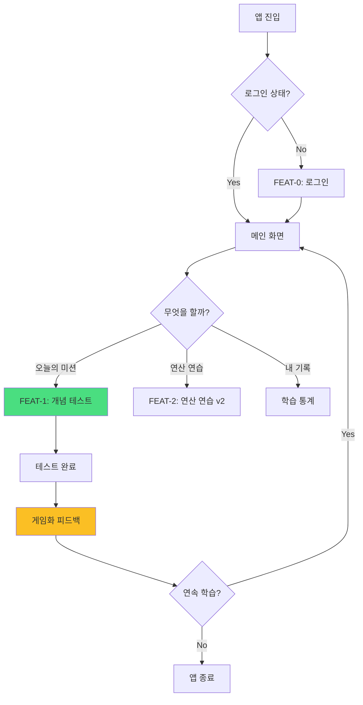

### 1.2 강사 여정

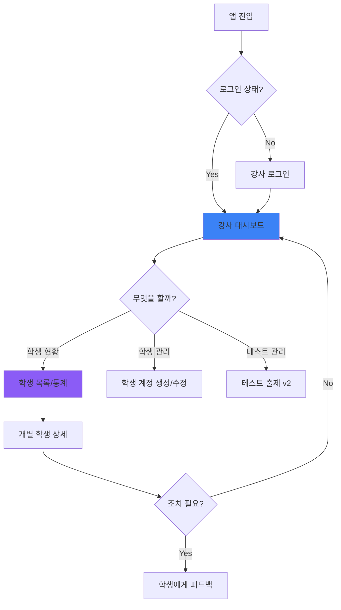

---

## 2. FEAT-0: 로그인 플로우

### 2.1 학생 로그인

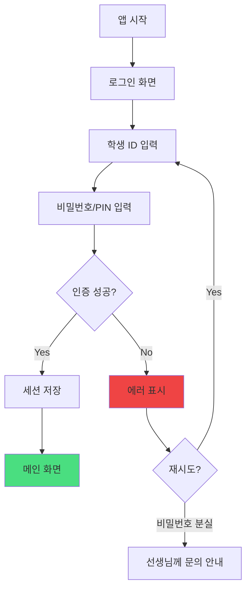

### 2.2 강사 로그인

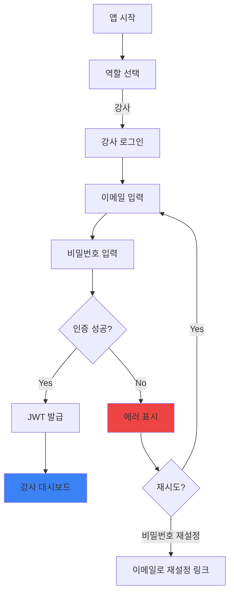

---

## 3. FEAT-1: 개념 테스트 플로우

### 3.1 테스트 시작

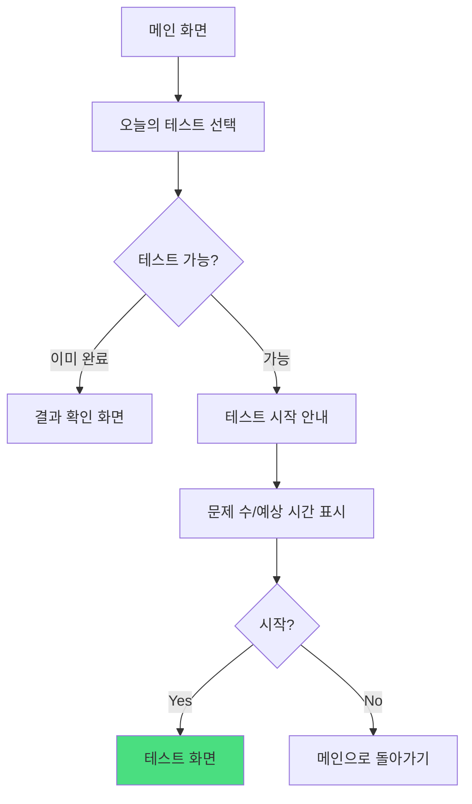

### 3.2 문제 풀이 (핵심 루프)

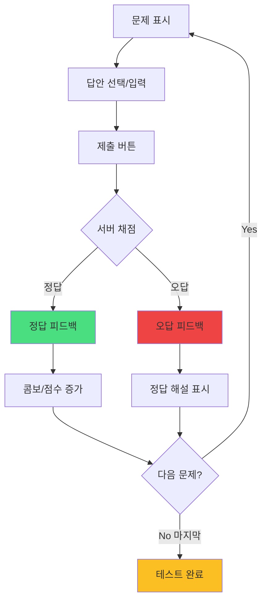

### 3.3 즉시 피드백 (게임화)

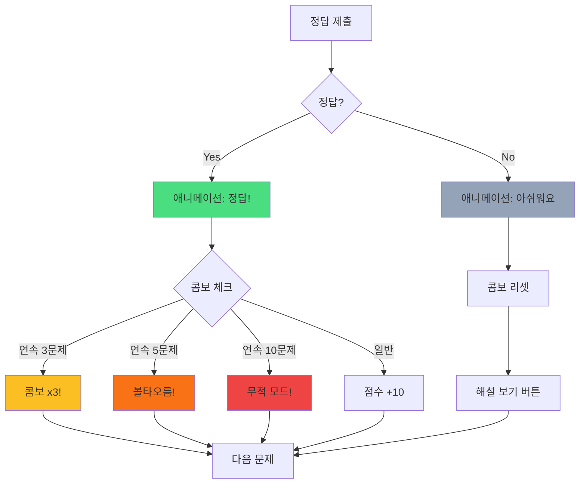

### 3.4 테스트 완료

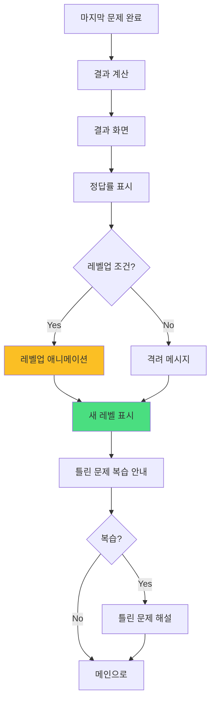

---

## 4. 강사 대시보드 플로우

### 4.1 학생 현황 조회

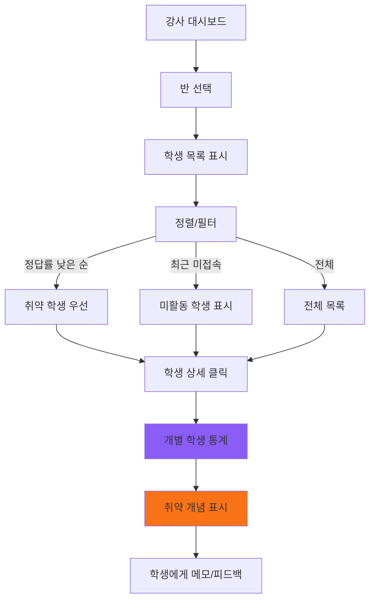

### 4.2 학생 계정 생성

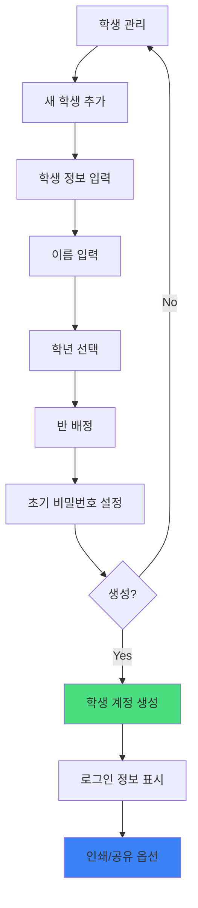

---

## 5. 리텐션 루프 (습관 형성)

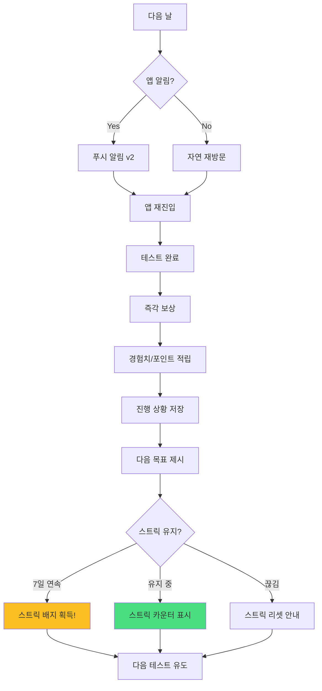

---

## 6. 에러 처리 플로우

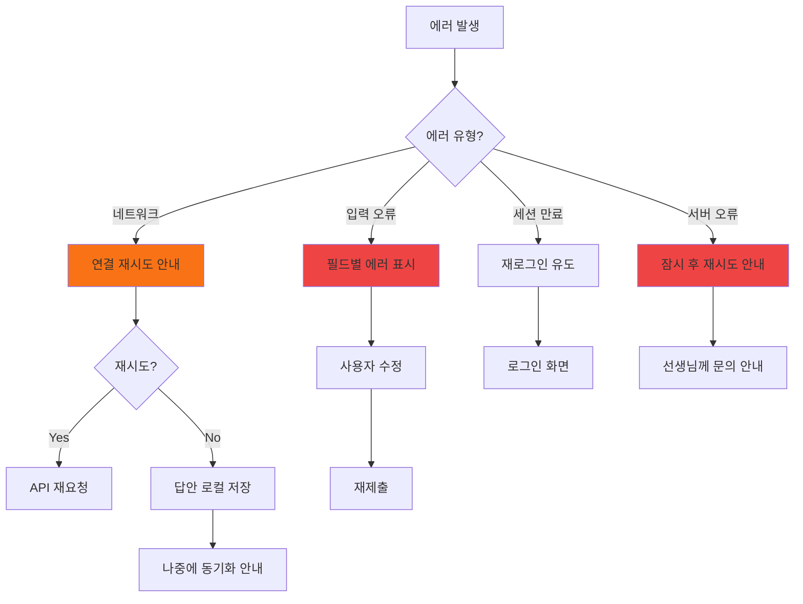

---

## 7. 화면 목록 (Screen Inventory)

### 7.1 학생 화면

| 화면 ID | 화면명 | FEAT | 진입점 | 주요 액션 |
|---------|--------|------|--------|----------|
| S-01 | 로그인 | FEAT-0 | 앱 시작 | 학생 ID/비밀번호 입력 |
| S-02 | 메인 (홈) | - | S-01 | 테스트 선택, 내 기록 확인 |
| S-03 | 테스트 선택 | FEAT-1 | S-02 | 오늘의 테스트 시작 |
| S-04 | 테스트 진행 | FEAT-1 | S-03 | 문제 풀기, 답안 제출 |
| S-05 | 즉시 피드백 | FEAT-1 | S-04 | 정답/오답 확인, 해설 보기 |
| S-06 | 테스트 결과 | FEAT-1 | S-04 | 점수, 레벨업, 틀린 문제 복습 |
| S-07 | 내 통계 | - | S-02 | 학습 기록, 성장 그래프 |

### 7.2 강사 화면

| 화면 ID | 화면명 | FEAT | 진입점 | 주요 액션 |
|---------|--------|------|--------|----------|
| T-01 | 강사 로그인 | FEAT-0 | 앱 시작 | 이메일/비밀번호 입력 |
| T-02 | 대시보드 | - | T-01 | 전체 현황 확인 |
| T-03 | 학생 목록 | - | T-02 | 학생 정렬/필터, 상세 진입 |
| T-04 | 학생 상세 | - | T-03 | 개별 학생 통계, 취약점 확인 |
| T-05 | 학생 관리 | FEAT-0 | T-02 | 학생 계정 생성/수정/삭제 |
| T-06 | 테스트 관리 | v2 | T-02 | 테스트 출제, 문제 관리 |

---

## 8. 화면 와이어프레임 (간략)

### 8.1 학생 메인 화면

```
┌─────────────────────────────────────┐
│  안녕, 민수! 오늘도 파이팅!          │  <- 인사 + 격려
├─────────────────────────────────────┤
│  🔥 7일 연속 학습 중!               │  <- 스트릭
├─────────────────────────────────────┤
│  ┌───────────────────────────────┐  │
│  │  📝 오늘의 미션                │  │
│  │  분수의 덧셈 개념 테스트        │  │
│  │  예상 시간: 5분                │  │
│  │        [시작하기]              │  │
│  └───────────────────────────────┘  │
├─────────────────────────────────────┤
│  최근 활동                          │
│  • 어제: 소수 테스트 90점 🎉        │
│  • 2일 전: 분수 기초 완료           │
├─────────────────────────────────────┤
│  [🏠 홈] [📊 내 기록] [⚙️ 설정]     │  <- 하단 네비게이션
└─────────────────────────────────────┘
```

### 8.2 테스트 진행 화면

```
┌─────────────────────────────────────┐
│  문제 3/10         콤보 x2 🔥        │  <- 진행 상황
├─────────────────────────────────────┤
│                                     │
│  다음 중 1/2 + 1/4의 값은?          │  <- 문제
│                                     │
│  ┌─────────────────────────────┐    │
│  │  ① 2/6                     │    │
│  └─────────────────────────────┘    │
│  ┌─────────────────────────────┐    │
│  │  ② 3/4   ✓                 │    │  <- 선택된 답
│  └─────────────────────────────┘    │
│  ┌─────────────────────────────┐    │
│  │  ③ 1/6                     │    │
│  └─────────────────────────────┘    │
│  ┌─────────────────────────────┐    │
│  │  ④ 2/4                     │    │
│  └─────────────────────────────┘    │
│                                     │
│           [제출하기]                │
└─────────────────────────────────────┘
```

### 8.3 정답 피드백 화면

```
┌─────────────────────────────────────┐
│                                     │
│            🎉 정답!                 │  <- 애니메이션
│                                     │
│           콤보 x3! 🔥               │
│           +30점                     │
│                                     │
│  ────────────────────────────────   │
│  1/2 + 1/4 = 2/4 + 1/4 = 3/4       │  <- 간단 해설
│  ────────────────────────────────   │
│                                     │
│          [다음 문제 →]              │
│                                     │
└─────────────────────────────────────┘
```

---

## Decision Log 참조

| ID | 항목 | 선택 | 근거 | 영향 |
|----|------|------|------|------|
| D-09 | 피드백 방식 | 즉시 피드백 (문제별) | 집중력 유지, 게임화 | 채점 API 호출 빈도 증가 |
| D-10 | 게임화 요소 | 콤보, 레벨, 스트릭 | 듀오링고 벤치마크 | UI 애니메이션 필요 |
| D-11 | 테스트 구조 | 문제 1개씩 표시 | 집중력, 모바일 최적화 | 한 화면에 한 문제 |
