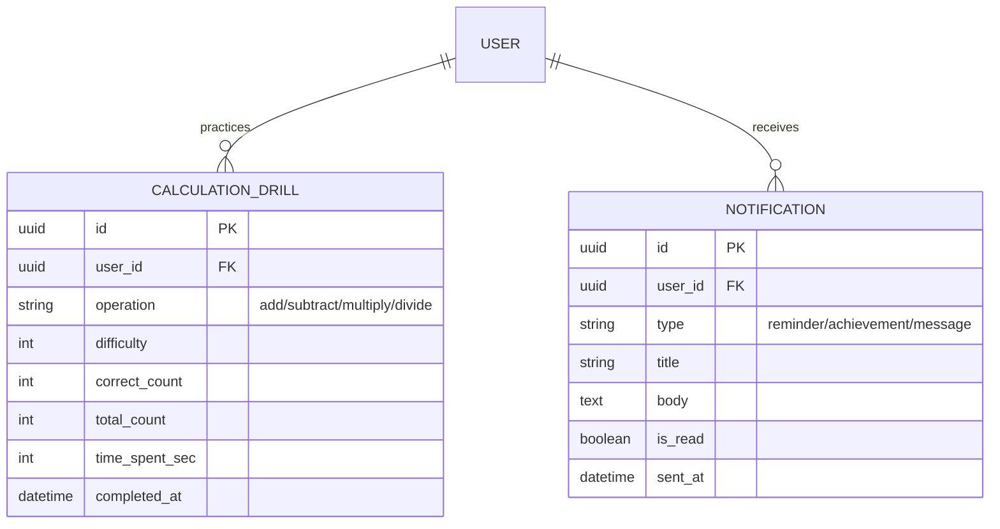

# Database Design (데이터베이스 설계)

> Mermaid ERD로 주요 엔티티와 관계를 표현합니다.
> 각 엔티티에 FEAT 주석을 달아 어떤 기능에서 사용되는지 명시합니다.
> 최소 수집 원칙을 반영하여 불필요한 개인정보는 지양합니다.

---

## MVP 캡슐

| # | 항목 | 내용 |
|---|------|------|
| 1 | 목표 | 강사 효율 극대화 + 학생 자기주도 학습 환경 구축 |
| 2 | 페르소나 | 초등~고1 학생 (공통수학), 학원 강사/관리자 |
| 3 | 핵심 기능 | FEAT-1: 개념 테스트 (수학 개념 이해도 확인) |
| 4 | 성공 지표 (노스스타) | 강사 개별 확인 시간 50% 절감 |
| 5 | 입력 지표 | 주간 테스트 완료 학생 비율, 평균 정답률 향상 |
| 6 | 비기능 요구 | 응답 시간 < 500ms, 모바일/태블릿 반응형 지원 |
| 7 | Out-of-scope | AI 개인 맞춤 추천, 학부모 앱, 결제 시스템 |
| 8 | Top 리스크 | 학생들이 재미없어서 안 쓸 수 있음 |
| 9 | 완화/실험 | 듀오링고 스타일 게임화 요소 적용 |
| 10 | 다음 단계 | 개념 테스트 문제 DB 설계 |

---

## 1. ERD (Entity Relationship Diagram)

```mermaid
erDiagram
    %% ========================================
    %% FEAT-0: 사용자 관리
    %% ========================================

    USER {
        uuid id PK "고유 식별자"
        string email UK "강사 로그인용 (학생은 NULL)"
        string password_hash "bcrypt 해싱"
        string username UK "학생 로그인 ID"
        string name "이름"
        string role "student/teacher/admin"
        int grade "학년 (1~10, 초1=1, 중1=7, 고1=10)"
        uuid class_id FK "소속 반"
        int level "게임화 레벨"
        int experience "경험치"
        int streak_days "연속 학습 일수"
        datetime last_activity_at "마지막 활동"
        datetime created_at "가입일"
        datetime updated_at "수정일"
        datetime deleted_at "탈퇴일 (soft delete)"
    }

    CLASS {
        uuid id PK "고유 식별자"
        string name "반 이름 (예: 초등5반)"
        uuid teacher_id FK "담당 강사"
        datetime created_at
        datetime updated_at
    }

    AUTH_TOKEN {
        uuid id PK
        uuid user_id FK
        string refresh_token UK
        datetime expires_at
        datetime created_at
    }

    %% ========================================
    %% FEAT-1: 개념 테스트 (문제 뱅크)
    %% ========================================

    CONCEPT {
        uuid id PK "고유 식별자"
        string name "개념명 (예: 분수의 덧셈)"
        string category "카테고리 (예: 분수)"
        int grade_level "해당 학년"
        int order_index "정렬 순서"
        datetime created_at
    }

    QUESTION {
        uuid id PK "고유 식별자"
        uuid concept_id FK "관련 개념"
        string type "객관식/주관식/OX"
        text content "문제 내용 (마크다운/LaTeX)"
        text image_url "문제 이미지 (선택)"
        jsonb options "객관식 선택지 (JSON)"
        string correct_answer "정답"
        text explanation "해설"
        int difficulty "난이도 (1~5)"
        datetime created_at
        datetime updated_at
    }

    TEST {
        uuid id PK "고유 식별자"
        string title "테스트 제목"
        uuid concept_id FK "테스트 대상 개념"
        int question_count "문제 수"
        int time_limit_sec "제한 시간 (초, NULL=무제한)"
        string status "draft/active/archived"
        uuid created_by FK "생성한 강사"
        datetime created_at
        datetime updated_at
    }

    TEST_QUESTION {
        uuid id PK
        uuid test_id FK
        uuid question_id FK
        int order_index "문제 순서"
    }

    %% ========================================
    %% FEAT-1: 학습 기록
    %% ========================================

    TEST_ATTEMPT {
        uuid id PK "고유 식별자"
        uuid user_id FK "응시 학생"
        uuid test_id FK "응시 테스트"
        int score "점수"
        int correct_count "정답 수"
        int total_count "전체 문제 수"
        int time_spent_sec "소요 시간"
        int max_combo "최대 콤보"
        string status "in_progress/completed/abandoned"
        datetime started_at "시작 시간"
        datetime completed_at "완료 시간"
    }

    ANSWER_LOG {
        uuid id PK
        uuid attempt_id FK "테스트 시도"
        uuid question_id FK "문제"
        string user_answer "학생 답안"
        boolean is_correct "정답 여부"
        int time_spent_sec "문제별 소요 시간"
        datetime answered_at "답변 시간"
    }

    %% ========================================
    %% 게임화 데이터
    %% ========================================

    ACHIEVEMENT {
        uuid id PK
        string code UK "배지 코드 (예: STREAK_7)"
        string name "배지 이름 (7일 연속 학습)"
        string description "설명"
        string icon "아이콘 URL"
        jsonb criteria "획득 조건 (JSON)"
    }

    USER_ACHIEVEMENT {
        uuid id PK
        uuid user_id FK
        uuid achievement_id FK
        datetime earned_at "획득 일시"
    }

    DAILY_STREAK {
        uuid id PK
        uuid user_id FK
        date activity_date UK "활동 날짜"
        int tests_completed "완료한 테스트 수"
        int total_score "하루 총 점수"
    }

    %% ========================================
    %% 관계 정의
    %% ========================================

    USER ||--o{ AUTH_TOKEN : "has"
    USER ||--o{ TEST_ATTEMPT : "takes"
    USER ||--o{ USER_ACHIEVEMENT : "earns"
    USER ||--o{ DAILY_STREAK : "tracks"
    USER }o--|| CLASS : "belongs_to"

    CLASS }o--|| USER : "has_teacher"

    CONCEPT ||--o{ QUESTION : "contains"
    CONCEPT ||--o{ TEST : "tests"

    TEST ||--o{ TEST_QUESTION : "includes"
    QUESTION ||--o{ TEST_QUESTION : "included_in"

    TEST ||--o{ TEST_ATTEMPT : "attempted_by"
    TEST_ATTEMPT ||--o{ ANSWER_LOG : "contains"
    QUESTION ||--o{ ANSWER_LOG : "answered_in"

    ACHIEVEMENT ||--o{ USER_ACHIEVEMENT : "awarded_to"
```

---

## 2. 엔티티 상세 정의

### 2.1 USER (사용자) - FEAT-0

| 컬럼 | 타입 | 제약조건 | 설명 |
|------|------|----------|------|
| id | UUID | PK | 고유 식별자 |
| email | VARCHAR(255) | UNIQUE, NULL 허용 | 강사 로그인용 (학생은 NULL) |
| password_hash | VARCHAR(255) | NOT NULL | bcrypt 해싱 |
| username | VARCHAR(50) | UNIQUE, NOT NULL | 학생 로그인 ID |
| name | VARCHAR(50) | NOT NULL | 이름 |
| role | VARCHAR(20) | NOT NULL | student/teacher/admin |
| grade | SMALLINT | NULL | 학년 (1~10, 초1=1, 중1=7, 고1=10) |
| class_id | UUID | FK, NULL | 소속 반 |
| level | INTEGER | DEFAULT 1 | 게임화 레벨 |
| experience | INTEGER | DEFAULT 0 | 경험치 |
| streak_days | INTEGER | DEFAULT 0 | 연속 학습 일수 |
| last_activity_at | TIMESTAMP | NULL | 마지막 활동 |
| created_at | TIMESTAMP | DEFAULT NOW() | 가입일 |
| updated_at | TIMESTAMP | NOT NULL | 수정일 |
| deleted_at | TIMESTAMP | NULL | Soft delete용 |

**인덱스:**
- `idx_user_email` ON email
- `idx_user_username` ON username
- `idx_user_role` ON role
- `idx_user_class_id` ON class_id

**최소 수집 원칙 적용:**
- 필수: username, name, role
- 선택: email (강사만), grade, class_id
- 수집 안 함: 전화번호, 주소, 생년월일

### 2.2 QUESTION (문제) - FEAT-1

| 컬럼 | 타입 | 제약조건 | 설명 |
|------|------|----------|------|
| id | UUID | PK | 고유 식별자 |
| concept_id | UUID | FK, NOT NULL | 관련 개념 |
| type | VARCHAR(20) | NOT NULL | multiple_choice/short_answer/ox |
| content | TEXT | NOT NULL | 문제 내용 (마크다운/LaTeX 지원) |
| image_url | VARCHAR(500) | NULL | 문제 이미지 URL |
| options | JSONB | NULL | 객관식 선택지 |
| correct_answer | VARCHAR(500) | NOT NULL | 정답 |
| explanation | TEXT | NOT NULL | 해설 |
| difficulty | SMALLINT | DEFAULT 3 | 난이도 (1~5) |
| created_at | TIMESTAMP | DEFAULT NOW() | 생성일 |
| updated_at | TIMESTAMP | NOT NULL | 수정일 |

**options JSONB 예시:**
```json
{
  "choices": [
    { "key": "1", "text": "2/6" },
    { "key": "2", "text": "3/4" },
    { "key": "3", "text": "1/6" },
    { "key": "4", "text": "2/4" }
  ]
}
```

**인덱스:**
- `idx_question_concept_id` ON concept_id
- `idx_question_difficulty` ON difficulty

### 2.3 TEST_ATTEMPT (테스트 시도) - FEAT-1

| 컬럼 | 타입 | 제약조건 | 설명 |
|------|------|----------|------|
| id | UUID | PK | 고유 식별자 |
| user_id | UUID | FK, NOT NULL | 응시 학생 |
| test_id | UUID | FK, NOT NULL | 응시 테스트 |
| score | INTEGER | DEFAULT 0 | 점수 |
| correct_count | INTEGER | DEFAULT 0 | 정답 수 |
| total_count | INTEGER | NOT NULL | 전체 문제 수 |
| time_spent_sec | INTEGER | DEFAULT 0 | 소요 시간 (초) |
| max_combo | INTEGER | DEFAULT 0 | 최대 콤보 |
| status | VARCHAR(20) | DEFAULT 'in_progress' | 상태 |
| started_at | TIMESTAMP | DEFAULT NOW() | 시작 시간 |
| completed_at | TIMESTAMP | NULL | 완료 시간 |

**인덱스:**
- `idx_attempt_user_id` ON user_id
- `idx_attempt_test_id` ON test_id
- `idx_attempt_completed_at` ON completed_at DESC
- `idx_attempt_user_test` ON (user_id, test_id, started_at DESC)

### 2.4 ANSWER_LOG (답안 기록) - FEAT-1

| 컬럼 | 타입 | 제약조건 | 설명 |
|------|------|----------|------|
| id | UUID | PK | 고유 식별자 |
| attempt_id | UUID | FK, NOT NULL | 테스트 시도 |
| question_id | UUID | FK, NOT NULL | 문제 |
| user_answer | VARCHAR(500) | NOT NULL | 학생 답안 |
| is_correct | BOOLEAN | NOT NULL | 정답 여부 |
| time_spent_sec | INTEGER | DEFAULT 0 | 문제별 소요 시간 |
| answered_at | TIMESTAMP | DEFAULT NOW() | 답변 시간 |

**인덱스:**
- `idx_answer_attempt_id` ON attempt_id
- `idx_answer_question_id` ON question_id

---

## 3. 관계 정의

| 부모 | 자식 | 관계 | 설명 |
|------|------|------|------|
| USER | AUTH_TOKEN | 1:N | 사용자는 여러 토큰 보유 가능 |
| USER | TEST_ATTEMPT | 1:N | 학생은 여러 테스트 응시 |
| USER | USER_ACHIEVEMENT | 1:N | 학생은 여러 배지 획득 |
| USER | DAILY_STREAK | 1:N | 학생의 일별 활동 기록 |
| CLASS | USER | 1:N | 반에 여러 학생 소속 |
| CONCEPT | QUESTION | 1:N | 개념에 여러 문제 포함 |
| CONCEPT | TEST | 1:N | 개념에 여러 테스트 연결 |
| TEST | TEST_QUESTION | 1:N | 테스트에 여러 문제 포함 |
| TEST | TEST_ATTEMPT | 1:N | 테스트에 여러 응시 기록 |
| TEST_ATTEMPT | ANSWER_LOG | 1:N | 응시에 여러 답안 기록 |

---

## 4. 데이터 생명주기

| 엔티티 | 생성 시점 | 보존 기간 | 삭제/익명화 |
|--------|----------|----------|------------|
| USER | 계정 생성 | 퇴원 후 1년 | Soft delete → Hard delete |
| AUTH_TOKEN | 로그인 | 만료 시 | Hard delete |
| CLASS | 반 생성 | 학원 운영 중 | Hard delete |
| CONCEPT | 초기 설정 | 영구 | - |
| QUESTION | 문제 등록 | 영구 | Soft delete |
| TEST | 테스트 생성 | 영구 | status='archived' |
| TEST_ATTEMPT | 테스트 시작 | 영구 | 퇴원 시 user_id 익명화 |
| ANSWER_LOG | 답안 제출 | 영구 | 상위와 동일 |
| ACHIEVEMENT | 초기 설정 | 영구 | - |
| USER_ACHIEVEMENT | 배지 획득 | 사용자와 동일 | Cascade |
| DAILY_STREAK | 매일 활동 | 영구 | 퇴원 시 user_id 익명화 |

---

## 5. 통계 쿼리 예시

### 5.1 학생별 개념별 정답률

```sql
SELECT
    u.id AS user_id,
    u.name AS student_name,
    c.name AS concept_name,
    COUNT(al.id) AS total_answers,
    SUM(CASE WHEN al.is_correct THEN 1 ELSE 0 END) AS correct_answers,
    ROUND(
        SUM(CASE WHEN al.is_correct THEN 1 ELSE 0 END) * 100.0 / COUNT(al.id),
        1
    ) AS accuracy_rate
FROM users u
JOIN test_attempts ta ON ta.user_id = u.id
JOIN answer_logs al ON al.attempt_id = ta.id
JOIN questions q ON q.id = al.question_id
JOIN concepts c ON c.id = q.concept_id
WHERE u.class_id = :class_id
GROUP BY u.id, u.name, c.id, c.name
ORDER BY u.name, c.name;
```

### 5.2 반 전체 취약 개념 파악

```sql
SELECT
    c.name AS concept_name,
    COUNT(al.id) AS total_answers,
    ROUND(
        SUM(CASE WHEN al.is_correct THEN 1 ELSE 0 END) * 100.0 / COUNT(al.id),
        1
    ) AS accuracy_rate
FROM users u
JOIN test_attempts ta ON ta.user_id = u.id
JOIN answer_logs al ON al.attempt_id = ta.id
JOIN questions q ON q.id = al.question_id
JOIN concepts c ON c.id = q.concept_id
WHERE u.class_id = :class_id
GROUP BY c.id, c.name
HAVING COUNT(al.id) >= 10  -- 최소 10문제 이상 데이터
ORDER BY accuracy_rate ASC
LIMIT 5;  -- 취약 개념 Top 5
```

### 5.3 주간 활동 학생 수

```sql
SELECT
    DATE_TRUNC('week', ds.activity_date) AS week,
    COUNT(DISTINCT ds.user_id) AS active_students
FROM daily_streaks ds
JOIN users u ON u.id = ds.user_id
WHERE u.class_id = :class_id
  AND ds.activity_date >= CURRENT_DATE - INTERVAL '4 weeks'
GROUP BY DATE_TRUNC('week', ds.activity_date)
ORDER BY week DESC;
```

---

## 6. 초기 데이터 (Seed)

### 6.1 개념 데이터 예시

```sql
INSERT INTO concepts (id, name, category, grade_level, order_index) VALUES
-- 초등 3학년
('uuid-1', '세 자리 수의 덧셈', '연산', 3, 1),
('uuid-2', '세 자리 수의 뺄셈', '연산', 3, 2),
('uuid-3', '곱셈 기초', '연산', 3, 3),
-- 초등 5학년
('uuid-4', '분수의 덧셈', '분수', 5, 1),
('uuid-5', '분수의 뺄셈', '분수', 5, 2),
('uuid-6', '소수의 덧셈', '소수', 5, 3),
-- 중등 1학년
('uuid-7', '정수와 유리수', '수와 연산', 7, 1),
('uuid-8', '일차방정식', '방정식', 7, 2),
-- 고등 1학년
('uuid-9', '다항식의 연산', '다항식', 10, 1),
('uuid-10', '인수분해', '다항식', 10, 2);
```

### 6.2 배지 데이터 예시

```sql
INSERT INTO achievements (id, code, name, description, icon, criteria) VALUES
('uuid-a1', 'STREAK_3', '3일 연속 학습', '3일 연속으로 테스트를 완료했어요!', '/badges/streak3.png', '{"streak_days": 3}'),
('uuid-a2', 'STREAK_7', '7일 연속 학습', '1주일 내내 공부했어요! 대단해요!', '/badges/streak7.png', '{"streak_days": 7}'),
('uuid-a3', 'STREAK_30', '30일 연속 학습', '한 달 동안 꾸준히! 수학 마스터!', '/badges/streak30.png', '{"streak_days": 30}'),
('uuid-a4', 'PERFECT_10', '연속 10문제 정답', '10문제 연속 정답! 완벽해요!', '/badges/perfect10.png', '{"combo": 10}'),
('uuid-a5', 'LEVEL_5', '레벨 5 달성', '레벨 5에 도달했어요!', '/badges/level5.png', '{"level": 5}'),
('uuid-a6', 'FIRST_TEST', '첫 테스트 완료', '첫 번째 테스트를 완료했어요!', '/badges/first.png', '{"tests_completed": 1}');
```

---

## 7. 확장 고려사항

### 7.1 v2에서 추가 예정 엔티티



### 7.2 인덱스 전략

- **읽기 최적화**: 자주 조회되는 컬럼에 인덱스
  - user_id (대부분의 조회가 학생 기준)
  - completed_at (최근 기록 조회)
  - concept_id (개념별 분석)
- **복합 인덱스**: 자주 함께 조회되는 컬럼
  - (user_id, test_id, started_at DESC) - 학생의 테스트 이력
  - (class_id, completed_at DESC) - 반별 최근 활동

---

## Decision Log 참조

| ID | 항목 | 선택 | 근거 | 영향 |
|----|------|------|------|------|
| D-12 | 문제 데이터 | JSONB options | 객관식 선택지 유연하게 저장 | PostgreSQL 필수 |
| D-13 | 게임화 저장 | 별도 테이블 | 스트릭, 배지 독립 관리 | 확장성 확보 |
| D-14 | 답안 기록 | 문제별 개별 저장 | 상세 분석 가능 | 데이터 양 증가 |
| D-15 | 소프트 삭제 | USER만 적용 | 학습 기록 유지 필요 | deleted_at 컬럼 |
