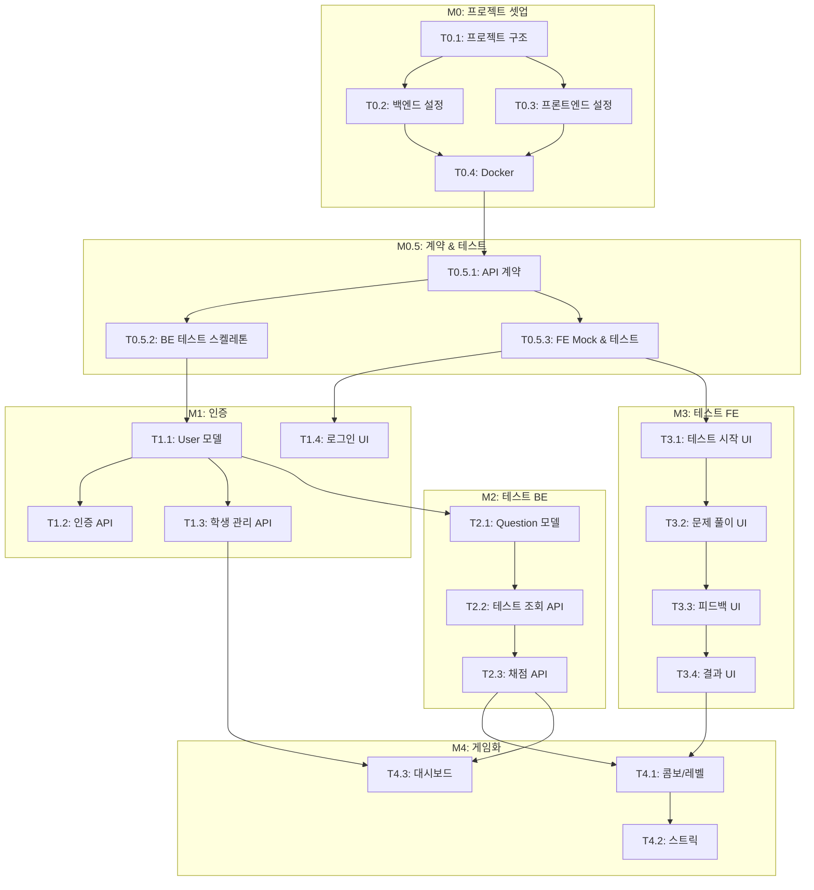

# TASKS: 수학 개념 및 연산 테스트 프로그램 - AI 개발 파트너용 태스크 목록

> 이 문서는 오케스트레이터와 서브에이전트가 사용하는 태스크 목록입니다.
> TDD 워크플로우와 Git Worktree 규칙이 적용됩니다.

---

## MVP 캡슐

| # | 항목 | 내용 |
|---|------|------|
| 1 | 목표 | 강사 효율 극대화 + 학생 자기주도 학습 환경 구축 |
| 2 | 페르소나 | 초등~고1 학생 (공통수학), 학원 강사/관리자 |
| 3 | 핵심 기능 | FEAT-1: 개념 테스트 (수학 개념 이해도 확인) |
| 4 | 성공 지표 (노스스타) | 강사 개별 확인 시간 50% 절감 |
| 5 | 입력 지표 | 주간 테스트 완료 학생 비율, 평균 정답률 향상 |
| 6 | 비기능 요구 | 응답 시간 < 500ms, 모바일/태블릿 반응형 지원 |
| 7 | Out-of-scope | AI 개인 맞춤 추천, 학부모 앱, 결제 시스템 |
| 8 | Top 리스크 | 학생들이 재미없어서 안 쓸 수 있음 |
| 9 | 완화/실험 | 듀오링고 스타일 게임화 요소 적용 |
| 10 | 다음 단계 | M0 프로젝트 셋업 시작 |

---

## 마일스톤 개요

| 마일스톤 | Phase | 설명 | 주요 기능 |
|----------|-------|------|----------|
| M0 | Phase 0 | 프로젝트 셋업 | 구조, 설정, Docker |
| M0.5 | Phase 0 | 계약 & 테스트 설계 | API 계약, Mock, 테스트 스켈레톤 |
| M1 | Phase 1 | FEAT-0 인증/계정 | 로그인, 학생/강사 계정 관리 |
| M2 | Phase 2 | FEAT-1 개념 테스트 (BE) | 문제 조회, 답안 제출, 채점 API |
| M3 | Phase 3 | FEAT-1 개념 테스트 (FE) | 테스트 UI, 즉시 피드백, 결과 화면 |
| M4 | Phase 4 | 게임화 & 통계 | 콤보, 레벨, 스트릭, 강사 대시보드 |

---

## M0: 프로젝트 셋업

### [] Phase 0, T0.1: 프로젝트 구조 생성

**담당**: frontend-specialist

**작업 내용**:
- 모노레포 구조 생성 (frontend/, backend/, contracts/)
- 기본 파일 생성 (README.md, .gitignore, .env.example)

**산출물**:
```
math-test/
├── frontend/
├── backend/
├── contracts/
├── docs/planning/
├── docker-compose.yml
├── .gitignore
├── .env.example
└── README.md
```

**완료 조건**:
- [ ] 디렉토리 구조 생성됨
- [ ] .gitignore에 .env, node_modules, __pycache__ 포함
- [ ] README.md에 프로젝트 개요 작성

---

### [] Phase 0, T0.2: 백엔드 초기 설정

**담당**: backend-specialist

**작업 내용**:
- FastAPI 프로젝트 초기화
- SQLAlchemy, Pydantic, Alembic 설정
- 기본 폴더 구조 생성

**산출물**:
```
backend/
├── app/
│   ├── __init__.py
│   ├── main.py
│   ├── core/
│   │   ├── config.py
│   │   ├── database.py
│   │   └── security.py
│   ├── api/v1/
│   ├── models/
│   ├── schemas/
│   └── services/
├── tests/
├── alembic/
├── alembic.ini
├── requirements.txt
└── pyproject.toml
```

**완료 조건**:
- [ ] `uvicorn app.main:app --reload` 실행 가능
- [ ] `/health` 엔드포인트 응답
- [ ] ruff + mypy 설정 완료

---

### [] Phase 0, T0.3: 프론트엔드 초기 설정

**담당**: frontend-specialist

**작업 내용**:
- Vite + React + TypeScript 프로젝트 생성
- TailwindCSS, Zustand, Axios 설치
- ESLint, Prettier 설정

**산출물**:
```
frontend/
├── src/
│   ├── components/
│   ├── pages/
│   ├── hooks/
│   ├── services/
│   ├── stores/
│   ├── types/
│   ├── mocks/
│   └── App.tsx
├── public/
├── package.json
├── tsconfig.json
├── tailwind.config.js
├── vite.config.ts
└── .eslintrc.cjs
```

**완료 조건**:
- [ ] `npm run dev` 실행 가능
- [ ] TailwindCSS 작동 확인
- [ ] ESLint + Prettier 설정 완료

---

### [] Phase 0, T0.4: Docker Compose 설정

**담당**: backend-specialist

**작업 내용**:
- PostgreSQL 컨테이너 설정
- 백엔드 컨테이너 설정
- 프론트엔드 컨테이너 설정

**산출물**:
- `docker-compose.yml`
- `backend/Dockerfile`
- `frontend/Dockerfile`

**완료 조건**:
- [ ] `docker-compose up` 실행 가능
- [ ] PostgreSQL 연결 확인
- [ ] 로컬 개발과 Docker 환경 모두 지원

---

## M0.5: 계약 & 테스트 설계 (Contract-First)

### [] Phase 0, T0.5.1: API 계약 정의

**담당**: backend-specialist

**작업 내용**:
- TypeScript 타입 정의 (contracts/)
- Pydantic 스키마 동기화 (backend/app/schemas/)
- 인증, 테스트, 통계 API 계약 정의

**산출물**:
```
contracts/
├── types.ts                 # 공통 타입
├── auth.contract.ts         # 인증 API 계약
├── test.contract.ts         # 테스트 API 계약
└── stats.contract.ts        # 통계 API 계약

backend/app/schemas/
├── auth.py
├── test.py
└── stats.py
```

**완료 조건**:
- [ ] 모든 API 엔드포인트의 Request/Response 타입 정의
- [ ] TypeScript ↔ Pydantic 동기화
- [ ] TRD 섹션 8과 일치

---

### [] Phase 0, T0.5.2: 백엔드 테스트 스켈레톤 작성

**담당**: test-specialist

**작업 내용**:
- pytest 설정 (conftest.py)
- API 테스트 파일 생성 (실패하는 테스트 스켈레톤)
- Factory Boy 설정

**산출물**:
```
backend/tests/
├── conftest.py              # pytest 설정, fixtures
├── factories.py             # Factory Boy 팩토리
├── api/
│   ├── test_auth.py         # 인증 API 테스트
│   ├── test_tests.py        # 테스트 API 테스트
│   └── test_stats.py        # 통계 API 테스트
└── unit/
    └── test_services.py     # 서비스 유닛 테스트
```

**완료 조건**:
- [ ] `pytest tests/` 실행 시 모든 테스트 FAILED (RED 상태)
- [ ] 각 API 엔드포인트별 테스트 케이스 최소 3개
- [ ] conftest.py에 DB fixture 설정

---

### [] Phase 0, T0.5.3: 프론트엔드 Mock & 테스트 설정

**담당**: frontend-specialist

**작업 내용**:
- MSW (Mock Service Worker) 설정
- Mock 핸들러 작성
- Vitest + React Testing Library 설정

**산출물**:
```
frontend/src/mocks/
├── browser.ts               # MSW 브라우저 설정
├── server.ts                # MSW 테스트 서버 설정
├── handlers/
│   ├── index.ts
│   ├── auth.ts              # 인증 API Mock
│   └── test.ts              # 테스트 API Mock
└── data/
    ├── users.ts             # Mock 사용자 데이터
    └── questions.ts         # Mock 문제 데이터

frontend/src/__tests__/
├── setup.ts                 # Vitest 설정
└── api/
    └── auth.test.ts         # API 테스트 스켈레톤
```

**완료 조건**:
- [ ] `npm run test` 실행 가능
- [ ] MSW 개발 모드 작동 확인
- [ ] Mock 데이터로 API 호출 시뮬레이션 가능

---

## M1: FEAT-0 인증/계정 시스템

### [] Phase 1, T1.1: 사용자 모델 & 마이그레이션 RED→GREEN

**담당**: database-specialist

**Git Worktree 설정**:
```bash
# 1. Worktree 생성
git worktree add ../math-test-phase1-user-model -b phase/1-user-model
cd ../math-test-phase1-user-model

# 2. 작업 완료 후 병합 (사용자 승인 필요)
# git checkout main
# git merge phase/1-user-model
# git worktree remove ../math-test-phase1-user-model
```

**TDD 사이클**:

1. **RED**: 테스트 작성 (실패 확인)
   ```bash
   # 테스트 파일: tests/unit/test_models.py
   pytest tests/unit/test_models.py -v  # Expected: FAILED
   ```

2. **GREEN**: 모델 구현 (테스트 통과)
   ```bash
   # 구현 파일: app/models/user.py
   alembic revision --autogenerate -m "Add user table"
   alembic upgrade head
   pytest tests/unit/test_models.py -v  # Expected: PASSED
   ```

3. **REFACTOR**: 정리
   - 인덱스 최적화
   - 필드 검증 추가

**산출물**:
- `backend/app/models/user.py`
- `backend/app/models/class_.py`
- `backend/alembic/versions/xxx_add_user_table.py`
- `backend/tests/unit/test_models.py`

**인수 조건**:
- [ ] 테스트 먼저 작성됨 (RED 확인)
- [ ] User, Class 모델 생성
- [ ] 마이그레이션 실행 성공
- [ ] 모든 테스트 통과 (GREEN)

---

### [] Phase 1, T1.2: 인증 API RED→GREEN

**담당**: backend-specialist

**Git Worktree 설정**:
```bash
git worktree add ../math-test-phase1-auth-api -b phase/1-auth-api
cd ../math-test-phase1-auth-api
```

**TDD 사이클**:

1. **RED**: 테스트 작성
   ```bash
   # 테스트 파일: tests/api/test_auth.py
   pytest tests/api/test_auth.py -v  # Expected: FAILED
   ```

2. **GREEN**: API 구현
   ```bash
   # 구현 파일: app/api/v1/auth.py, app/services/auth_service.py
   pytest tests/api/test_auth.py -v  # Expected: PASSED
   ```

**산출물**:
- `backend/app/api/v1/auth.py`
- `backend/app/services/auth_service.py`
- `backend/app/core/security.py` (JWT 유틸)
- `backend/tests/api/test_auth.py`

**인수 조건**:
- [ ] POST /api/v1/auth/login - 학생/강사 로그인
- [ ] POST /api/v1/auth/refresh - 토큰 갱신
- [ ] POST /api/v1/auth/logout - 로그아웃
- [ ] JWT 발급 및 검증 동작
- [ ] 모든 테스트 통과

---

### [] Phase 1, T1.3: 학생 관리 API RED→GREEN

**담당**: backend-specialist

**Git Worktree 설정**:
```bash
git worktree add ../math-test-phase1-student-api -b phase/1-student-api
cd ../math-test-phase1-student-api
```

**의존성**: T1.1 (User 모델) - **이미 main에 병합되어 있어야 함**

**TDD 사이클**:

1. **RED**: 테스트 작성
   ```bash
   pytest tests/api/test_students.py -v  # Expected: FAILED
   ```

2. **GREEN**: API 구현
   ```bash
   # 구현 파일: app/api/v1/students.py
   pytest tests/api/test_students.py -v  # Expected: PASSED
   ```

**산출물**:
- `backend/app/api/v1/students.py`
- `backend/app/services/student_service.py`
- `backend/tests/api/test_students.py`

**인수 조건**:
- [ ] GET /api/v1/students - 학생 목록 (강사 전용)
- [ ] POST /api/v1/students - 학생 생성 (강사 전용)
- [ ] PATCH /api/v1/students/{id} - 학생 수정
- [ ] 권한 검증 동작
- [ ] 모든 테스트 통과

---

### [] Phase 1, T1.4: 로그인 UI RED→GREEN

**담당**: frontend-specialist

**Git Worktree 설정**:
```bash
git worktree add ../math-test-phase1-login-ui -b phase/1-login-ui
cd ../math-test-phase1-login-ui
```

**의존성**: T0.5.3 (MSW Mock) - **Mock 사용으로 독립 개발 가능**

**TDD 사이클**:

1. **RED**: 테스트 작성
   ```bash
   # 테스트 파일: src/__tests__/pages/Login.test.tsx
   npm run test -- src/__tests__/pages/Login.test.tsx  # Expected: FAILED
   ```

2. **GREEN**: 컴포넌트 구현
   ```bash
   # 구현 파일: src/pages/Login.tsx
   npm run test -- src/__tests__/pages/Login.test.tsx  # Expected: PASSED
   ```

**산출물**:
- `frontend/src/pages/Login.tsx`
- `frontend/src/components/ui/Input.tsx`
- `frontend/src/components/ui/Button.tsx`
- `frontend/src/stores/authStore.ts`
- `frontend/src/__tests__/pages/Login.test.tsx`

**인수 조건**:
- [ ] 학생 ID + 비밀번호 입력 폼
- [ ] 로그인 성공 시 메인 페이지 이동
- [ ] 에러 메시지 표시
- [ ] 모든 테스트 통과

---

## M2: FEAT-1 개념 테스트 (Backend)

### [] Phase 2, T2.1: 문제 & 테스트 모델 RED→GREEN

**담당**: database-specialist

**Git Worktree 설정**:
```bash
git worktree add ../math-test-phase2-question-model -b phase/2-question-model
cd ../math-test-phase2-question-model
```

**TDD 사이클**:

1. **RED**: 테스트 작성
   ```bash
   pytest tests/unit/test_question_models.py -v  # Expected: FAILED
   ```

2. **GREEN**: 모델 구현
   ```bash
   alembic revision --autogenerate -m "Add question and test tables"
   alembic upgrade head
   pytest tests/unit/test_question_models.py -v  # Expected: PASSED
   ```

**산출물**:
- `backend/app/models/concept.py`
- `backend/app/models/question.py`
- `backend/app/models/test.py`
- `backend/app/models/test_attempt.py`
- `backend/app/models/answer_log.py`
- `backend/alembic/versions/xxx_add_question_tables.py`

**인수 조건**:
- [ ] Concept, Question, Test, TestAttempt, AnswerLog 모델 생성
- [ ] JSONB 타입 (options) 동작
- [ ] 모든 관계(FK) 설정
- [ ] 모든 테스트 통과

---

### [] Phase 2, T2.2: 테스트 조회 API RED→GREEN

**담당**: backend-specialist

**Git Worktree 설정**:
```bash
git worktree add ../math-test-phase2-test-api -b phase/2-test-api
cd ../math-test-phase2-test-api
```

**의존성**: T2.1 (Question 모델) - **이미 main에 병합되어 있어야 함**

**TDD 사이클**:

1. **RED**: 테스트 작성
   ```bash
   pytest tests/api/test_tests.py::test_get_available_tests -v
   pytest tests/api/test_tests.py::test_get_test_detail -v
   ```

2. **GREEN**: API 구현
   ```bash
   # 구현: app/api/v1/tests.py
   pytest tests/api/test_tests.py -v  # Expected: PASSED
   ```

**산출물**:
- `backend/app/api/v1/tests.py`
- `backend/app/services/test_service.py`
- `backend/tests/api/test_tests.py`

**인수 조건**:
- [ ] GET /api/v1/tests/available - 풀 수 있는 테스트 목록
- [ ] GET /api/v1/tests/{id} - 테스트 상세 (문제 포함)
- [ ] 학년별 필터링 동작
- [ ] 모든 테스트 통과

---

### [] Phase 2, T2.3: 답안 제출 & 채점 API RED→GREEN

**담당**: backend-specialist

**Git Worktree 설정**:
```bash
git worktree add ../math-test-phase2-submit-api -b phase/2-submit-api
cd ../math-test-phase2-submit-api
```

**TDD 사이클**:

1. **RED**: 테스트 작성
   ```bash
   pytest tests/api/test_tests.py::test_submit_answer -v
   pytest tests/api/test_tests.py::test_grading_correct -v
   pytest tests/api/test_tests.py::test_grading_incorrect -v
   ```

2. **GREEN**: 채점 로직 구현
   ```bash
   pytest tests/api/test_tests.py -v  # Expected: PASSED
   ```

**산출물**:
- `backend/app/api/v1/tests.py` (submit 엔드포인트 추가)
- `backend/app/services/grading_service.py`
- `backend/tests/api/test_tests.py`

**인수 조건**:
- [ ] POST /api/v1/tests/{id}/submit - 답안 제출 + 즉시 채점
- [ ] 정답 체크 로직 동작
- [ ] AnswerLog 저장
- [ ] 응답 시간 < 200ms
- [ ] 모든 테스트 통과

---

## M3: FEAT-1 개념 테스트 (Frontend)

### [] Phase 3, T3.1: 테스트 시작 화면 RED→GREEN

**담당**: frontend-specialist

**Git Worktree 설정**:
```bash
git worktree add ../math-test-phase3-test-start -b phase/3-test-start
cd ../math-test-phase3-test-start
```

**의존성**: T0.5.3 (MSW Mock) - **Mock 사용으로 독립 개발 가능**

**TDD 사이클**:

1. **RED**: 테스트 작성
   ```bash
   npm run test -- src/__tests__/pages/TestStart.test.tsx
   ```

2. **GREEN**: 컴포넌트 구현
   ```bash
   npm run test -- src/__tests__/pages/TestStart.test.tsx  # PASSED
   ```

**산출물**:
- `frontend/src/pages/student/TestStart.tsx`
- `frontend/src/components/test/TestCard.tsx`
- `frontend/src/__tests__/pages/TestStart.test.tsx`

**인수 조건**:
- [ ] 오늘의 테스트 목록 표시
- [ ] 테스트 정보 (문제 수, 예상 시간)
- [ ] 시작하기 버튼 → 테스트 화면 이동
- [ ] 모든 테스트 통과

---

### [] Phase 3, T3.2: 문제 풀이 UI RED→GREEN

**담당**: frontend-specialist

**Git Worktree 설정**:
```bash
git worktree add ../math-test-phase3-question-ui -b phase/3-question-ui
cd ../math-test-phase3-question-ui
```

**TDD 사이클**:

1. **RED**: 테스트 작성
   ```bash
   npm run test -- src/__tests__/components/QuestionCard.test.tsx
   npm run test -- src/__tests__/components/AnswerOption.test.tsx
   ```

2. **GREEN**: 컴포넌트 구현
   ```bash
   npm run test -- src/__tests__/components/  # PASSED
   ```

**산출물**:
- `frontend/src/pages/student/TestPlay.tsx`
- `frontend/src/components/test/QuestionCard.tsx`
- `frontend/src/components/test/AnswerOption.tsx`
- `frontend/src/components/test/ProgressBar.tsx`
- `frontend/src/__tests__/components/QuestionCard.test.tsx`

**인수 조건**:
- [ ] 문제 내용 표시 (마크다운/LaTeX 지원)
- [ ] 선택지 버튼 (선택 상태 표시)
- [ ] 진행 바 (3/10)
- [ ] 제출 버튼
- [ ] 모든 테스트 통과

---

### [] Phase 3, T3.3: 즉시 피드백 UI RED→GREEN

**담당**: frontend-specialist

**Git Worktree 설정**:
```bash
git worktree add ../math-test-phase3-feedback-ui -b phase/3-feedback-ui
cd ../math-test-phase3-feedback-ui
```

**TDD 사이클**:

1. **RED**: 테스트 작성
   ```bash
   npm run test -- src/__tests__/components/FeedbackModal.test.tsx
   ```

2. **GREEN**: 컴포넌트 구현 + 애니메이션
   ```bash
   npm run test -- src/__tests__/components/FeedbackModal.test.tsx  # PASSED
   ```

**산출물**:
- `frontend/src/components/test/FeedbackModal.tsx`
- `frontend/src/components/test/CorrectFeedback.tsx`
- `frontend/src/components/test/IncorrectFeedback.tsx`
- `frontend/src/__tests__/components/FeedbackModal.test.tsx`

**인수 조건**:
- [ ] 정답 시: "정답!" 애니메이션 + 점수 표시
- [ ] 오답 시: "아쉬워요" + 해설 표시
- [ ] Framer Motion 애니메이션 적용
- [ ] 다음 문제 버튼
- [ ] 모든 테스트 통과

---

### [] Phase 3, T3.4: 테스트 결과 화면 RED→GREEN

**담당**: frontend-specialist

**Git Worktree 설정**:
```bash
git worktree add ../math-test-phase3-result-ui -b phase/3-result-ui
cd ../math-test-phase3-result-ui
```

**산출물**:
- `frontend/src/pages/student/TestResult.tsx`
- `frontend/src/components/test/ScoreCard.tsx`
- `frontend/src/components/test/WrongAnswerList.tsx`
- `frontend/src/__tests__/pages/TestResult.test.tsx`

**인수 조건**:
- [ ] 총점, 정답률 표시
- [ ] 레벨업 조건 시 애니메이션
- [ ] 틀린 문제 목록 + 복습 버튼
- [ ] 메인으로 돌아가기
- [ ] 모든 테스트 통과

---

## M4: 게임화 & 통계

### [] Phase 4, T4.1: 콤보 & 레벨 시스템 RED→GREEN

**담당**: frontend-specialist + backend-specialist

**Git Worktree 설정**:
```bash
git worktree add ../math-test-phase4-gamification -b phase/4-gamification
cd ../math-test-phase4-gamification
```

**산출물 (BE)**:
- `backend/app/services/gamification_service.py`
- `backend/tests/unit/test_gamification.py`

**산출물 (FE)**:
- `frontend/src/components/gamification/ComboDisplay.tsx`
- `frontend/src/components/gamification/LevelUpModal.tsx`
- `frontend/src/stores/gamificationStore.ts`

**인수 조건**:
- [ ] 연속 정답 시 콤보 증가 (x2, x3, ...)
- [ ] 레벨업 조건 체크 및 경험치 계산
- [ ] 콤보 애니메이션 (불꽃 효과)
- [ ] 레벨업 애니메이션 (골드 플래시)
- [ ] 모든 테스트 통과

---

### [] Phase 4, T4.2: 스트릭 시스템 RED→GREEN

**담당**: backend-specialist + frontend-specialist

**Git Worktree 설정**:
```bash
git worktree add ../math-test-phase4-streak -b phase/4-streak
cd ../math-test-phase4-streak
```

**산출물 (BE)**:
- `backend/app/models/daily_streak.py`
- `backend/app/services/streak_service.py`
- `backend/tests/unit/test_streak.py`

**산출물 (FE)**:
- `frontend/src/components/gamification/StreakDisplay.tsx`
- `frontend/src/components/gamification/StreakBadge.tsx`

**인수 조건**:
- [ ] 일일 활동 기록 저장
- [ ] 연속 학습일 계산
- [ ] 스트릭 배지 표시 (3일, 7일, 30일)
- [ ] 모든 테스트 통과

---

### [] Phase 4, T4.3: 강사 대시보드 RED→GREEN

**담당**: frontend-specialist + backend-specialist

**Git Worktree 설정**:
```bash
git worktree add ../math-test-phase4-dashboard -b phase/4-dashboard
cd ../math-test-phase4-dashboard
```

**산출물 (BE)**:
- `backend/app/api/v1/stats.py`
- `backend/app/services/stats_service.py`
- `backend/tests/api/test_stats.py`

**산출물 (FE)**:
- `frontend/src/pages/teacher/Dashboard.tsx`
- `frontend/src/pages/teacher/StudentList.tsx`
- `frontend/src/pages/teacher/StudentDetail.tsx`
- `frontend/src/components/dashboard/StatCard.tsx`

**인수 조건**:
- [ ] GET /api/v1/stats/students - 학생별 통계
- [ ] GET /api/v1/stats/concepts - 개념별 정답률
- [ ] 학생 목록 (정렬/필터)
- [ ] 개별 학생 상세 (취약 개념 표시)
- [ ] 모든 테스트 통과

---

## 의존성 그래프



---

## 병렬 실행 가능 태스크

| 단계 | 병렬 실행 가능 태스크 | 조건 |
|------|----------------------|------|
| M0 | T0.2, T0.3 | T0.1 완료 후 |
| M0.5 | T0.5.2, T0.5.3 | T0.5.1 완료 후 |
| M1 | T1.2, T1.3 (BE) / T1.4 (FE) | T1.1 완료 후 BE/FE 병렬 |
| M2+M3 | T2.X (BE) / T3.X (FE) | Mock 사용으로 완전 병렬 가능 |
| M4 | T4.1 (BE+FE) / T4.2 (BE+FE) | M2+M3 완료 후 |

---

## 에이전트 역할 분담

| 에이전트 | 담당 태스크 |
|----------|------------|
| **database-specialist** | T1.1, T2.1 (모델, 마이그레이션) |
| **backend-specialist** | T0.2, T0.4, T0.5.1, T1.2, T1.3, T2.2, T2.3, T4.1(BE), T4.2(BE), T4.3(BE) |
| **frontend-specialist** | T0.1, T0.3, T0.5.3, T1.4, T3.1~T3.4, T4.1(FE), T4.2(FE), T4.3(FE) |
| **test-specialist** | T0.5.2, 각 태스크 테스트 리뷰 |

---

## 완료 체크리스트

- [ ] M0: 프로젝트 셋업 완료
- [ ] M0.5: 계약 & 테스트 설계 완료 (모든 테스트 RED)
- [ ] M1: 인증/계정 완료 (모든 테스트 GREEN)
- [ ] M2: 테스트 BE 완료 (모든 테스트 GREEN)
- [ ] M3: 테스트 FE 완료 (모든 테스트 GREEN)
- [ ] M4: 게임화 & 통계 완료 (모든 테스트 GREEN)
- [ ] E2E 테스트 통과
- [ ] 배포 준비 완료
