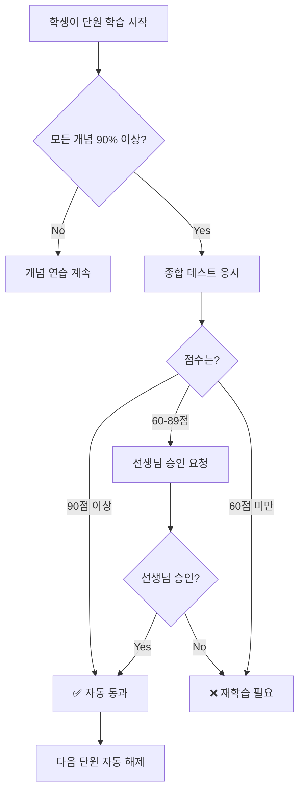

# 테스트 시스템 설계 가이드

> 작성일: 2026-02-03
> 적용 버전: v1.0 (점수 정규화 시스템)

## 목차
1. [시스템 개요](#시스템-개요)
2. [점수 정규화 시스템](#점수-정규화-시스템)
3. [테스트 설계 가이드라인](#테스트-설계-가이드라인)
4. [단원 완료 조건](#단원-완료-조건)
5. [구현 예시](#구현-예시)

---

## 시스템 개요

### 핵심 기능
- **적응형 학습**: 학생의 실력에 맞는 맞춤 학습 경로 제공
- **개념 마스터리**: 개념별 90% 이상 숙련도 달성 시스템
- **단원 진행 관리**: 종합 테스트 기반 단원 완료 및 자동 해제
- **점수 정규화**: 모든 테스트를 100점 만점 기준으로 평가

### 주요 임계값
```python
# 개념 마스터리
MASTERY_THRESHOLD = 90  # 90% 이상 = 마스터

# 단원 완료
AUTO_PASS_SCORE = 90    # 90점 이상 = 자동 통과
TEACHER_APPROVAL_MIN_SCORE = 60  # 60-89점 = 선생님 승인 가능
# 60점 미만 = 통과 불가
```

---

## 점수 정규화 시스템

### 필요성
테스트마다 문제 수와 배점이 다르기 때문에, 일관된 기준으로 평가하기 위해 모든 점수를 100점 만점으로 정규화합니다.

### 구현
**파일**: `backend/app/services/chapter_service.py`

```python
def _check_final_test(self, student_id, chapter, progress):
    """종합 테스트 결과 확인 및 업데이트."""
    best_attempt = self.db.scalar(
        select(TestAttempt)
        .where(
            TestAttempt.test_id == chapter.final_test_id,
            TestAttempt.student_id == student_id,
            TestAttempt.completed_at.isnot(None)
        )
        .order_by(TestAttempt.score.desc())
        .limit(1)
    )

    if best_attempt:
        # 점수를 100점 만점으로 정규화
        max_score = best_attempt.max_score or 100
        normalized_score = int((best_attempt.score / max_score) * 100)
        progress.final_test_score = normalized_score

        # 90점 이상: 자동 통과
        if normalized_score >= AUTO_PASS_SCORE:
            progress.final_test_passed = True
```

### 예시
| 원점수 | 만점 | 정규화 | 결과 |
|--------|------|--------|------|
| 30/30 | 30 | 100% | ✅ 자동 통과 |
| 108/120 | 120 | 90% | ✅ 자동 통과 |
| 85/120 | 120 | 71% | ⚠️ 선생님 승인 필요 |
| 20/135 | 135 | 15% | ❌ 불합격 |

---

## 테스트 설계 가이드라인

### 1. 문제 수 권장사항

#### 개념 테스트 (Concept Test)
```yaml
문제 수: 5-8문제
시간: 10-15분
목적: 특정 개념 이해도 평가
배점: 각 10점 (총 50-80점)
```

#### 단원 종합 테스트 (Chapter Final Test)
```yaml
문제 수: 12-20문제 ⭐ 권장!
시간: 20-30분
목적: 단원 전체 마스터 여부 판정
배점: 각 10점 (총 120-200점)
```

#### 진단 평가 (Placement Test)
```yaml
문제 수: 10-15문제
시간: 15-20분
목적: 학생의 현재 수준 파악
배점: 각 10점 (총 100-150점)
```

### 2. 문제 배점 통일 원칙

**✅ 권장: 모든 문제 10점**
```python
# 이유
- 계산 간단 (12문제 = 120점)
- 정규화 명확 (108/120 = 90%)
- 학생 이해 쉬움
```

**⚠️ 예외: 난이도별 차등 배점**
```python
# 사용 시 주의사항
쉬움: 5점
보통: 10점
어려움: 15점

# 장점: 난이도 반영
# 단점: max_score 예측 어려움, 정규화 필수
```

### 3. 난이도 분포

**권장 비율** (단원 종합 테스트 기준)
```
쉬움 (난이도 1-4): 30% (4문제)
보통 (난이도 5-7): 40% (5문제)
어려움 (난이도 8-10): 30% (3문제)

총 12문제 기준:
- 쉬움: 4문제 × 10점 = 40점
- 보통: 5문제 × 10점 = 50점
- 어려움: 3문제 × 10점 = 30점
합계: 120점 → 90점 합격 (75% 정답)
```

### 4. 합격선 설계

| 정규화 점수 | 정답률 (12문제) | 평가 | 조치 |
|-------------|----------------|------|------|
| 90-100% | 11-12개 | 우수 | 자동 통과 |
| 75-89% | 9-10개 | 양호 | 선생님 판단 |
| 60-74% | 7-8개 | 보통 | 선생님 판단 |
| 40-59% | 5-6개 | 부족 | 재학습 권장 |
| 0-39% | 0-4개 | 미흡 | 개념 재학습 |

---

## 단원 완료 조건

### 조건 체크 로직
**파일**: `backend/app/services/chapter_service.py`

```python
def _check_chapter_completion(
    self, chapter, progress, mastered_count, total_concepts
) -> bool:
    """단원 완료 조건 체크.

    조건:
    1. 모든 개념 90% 이상 마스터
    2. 종합 테스트 90점 이상 (자동)
       또는 60점 이상 + 선생님 승인
    """
    # 1. 개념 마스터리 체크
    if total_concepts == 0 or mastered_count < total_concepts:
        return False

    # 2. 종합 테스트 체크
    if chapter.final_test_id:
        if not progress.final_test_attempted:
            return False

        # 90점 이상: 자동 통과
        if progress.final_test_score >= AUTO_PASS_SCORE:
            return True

        # 60-89점: 선생님 승인 필요
        if (progress.final_test_score >= TEACHER_APPROVAL_MIN_SCORE
            and progress.teacher_approved):
            return True

        return False

    # 종합 테스트 없으면 개념만으로 판정
    return True
```

### 완료 플로우



---

## 구현 예시

### 종합 테스트 생성 (12문제)

```python
# backend/app/main.py

comprehensive_test = Test(
    id="test-chapter1-final",
    title="1단원 종합 테스트 - 소인수분해",
    description="소인수분해 단원의 모든 개념을 평가하는 종합 테스트",
    grade="middle_1",
    concept_ids=[
        "concept-prime",
        "concept-factorization",
        "concept-gcd-lcm"
    ],
    question_ids=[
        # 쉬움 (5문제 - 50점)
        "q1-prime-basic",
        "q2-prime-identify",
        "q3-factor-simple",
        "q4-gcd-basic",
        "q5-lcm-basic",

        # 보통 (5문제 - 50점)
        "q6-factor-medium",
        "q7-gcd-medium",
        "q8-lcm-medium",
        "q9-prime-composite",
        "q10-factor-tree",

        # 어려움 (2문제 - 20점)
        "q11-gcd-lcm-combined",
        "q12-word-problem",
    ],
    question_count=12,
    time_limit_minutes=20,
    is_active=True,
)
```

### Chapter 설정

```python
chapter1 = Chapter(
    id="chapter-m1-01",
    name="1. 소인수분해",
    grade="middle_1",
    chapter_number=1,
    concept_ids=[
        "concept-prime",
        "concept-factorization",
        "concept-gcd-lcm"
    ],
    final_test_id="test-chapter1-final",  # ⭐ 종합 테스트 연결
    mastery_threshold=90,
    final_test_pass_score=90,
    require_teacher_approval=False,
    is_active=True,
)
```

### 문제 생성 (난이도별)

```python
# 쉬움 (난이도 1-4)
Question(
    id="q1-prime-basic",
    concept_id="concept-prime",
    category="concept",
    part="calc",
    question_type="multiple_choice",
    difficulty=3,  # ⭐ 쉬움
    content="다음 중 소수인 것은?",
    points=10,     # ⭐ 통일된 배점
)

# 보통 (난이도 5-7)
Question(
    id="q6-factor-medium",
    concept_id="concept-factorization",
    category="concept",
    part="calc",
    question_type="multiple_choice",
    difficulty=6,  # ⭐ 보통
    content="72를 소인수분해하시오.",
    points=10,
)

# 어려움 (난이도 8-10)
Question(
    id="q11-gcd-lcm-combined",
    concept_id="concept-gcd-lcm",
    category="concept",
    part="calc",
    question_type="multiple_choice",
    difficulty=9,  # ⭐ 어려움
    content="두 수 a, b의 최대공약수가 12이고 최소공배수가 360일 때...",
    points=10,
)
```

---

## 검증 체크리스트

### 테스트 생성 시
- [ ] 문제 수: 12개 이상 (종합 테스트)
- [ ] 시간 제한: 20분 이상
- [ ] 난이도 분포: 쉬움 40%, 보통 40%, 어려움 20%
- [ ] 배점: 모든 문제 10점 (권장)
- [ ] 총점: 120점 이상
- [ ] final_test_id: Chapter에 정확히 연결

### 단원 설정 시
- [ ] concept_ids: 최소 1개 이상
- [ ] final_test_id: 종합 테스트 지정
- [ ] mastery_threshold: 90 설정
- [ ] final_test_pass_score: 90 설정

### 배포 전 확인
- [ ] 정규화 로직 정상 작동
- [ ] 90점 이상 자동 통과 확인
- [ ] 60-89점 선생님 승인 대기 확인
- [ ] 개념 마스터리 90% 체크 작동

---

## 현재 시스템 상태 (2026-02-03)

### 구현 완료
✅ 점수 정규화 시스템
✅ 12문제 종합 테스트 (test-001)
✅ 개념 마스터리 시스템 (90% 임계값)
✅ 단원 자동 완료 로직
✅ 진단 평가 및 배치 시스템

### 검증 완료
✅ 20/135 → 14% 정규화
✅ 14% < 90% → 불합격 처리
✅ 30/30 → 100% 정규화
✅ 100% ≥ 90% → 자동 통과

### 향후 개선사항
1. **문제 수 확대**: 종합 테스트 15-20문제로 확대
2. **배점 문서화**: 각 문제의 배점 근거 명시
3. **난이도 검증**: 실제 학생 데이터로 난이도 재조정
4. **선생님 승인 UI**: 60-89점 구간 승인 인터페이스 개발

---

## 참고 자료

- [2022 개정 교육과정 구조](./2022_curriculum_structure.md)
- `backend/app/services/chapter_service.py` - 단원 완료 로직
- `backend/app/services/mastery_service.py` - 개념 마스터리 로직
- `backend/app/main.py` - 시드 데이터 및 테스트 정의

---

**문서 버전**: 1.0
**마지막 업데이트**: 2026-02-03
**작성자**: Claude Code
